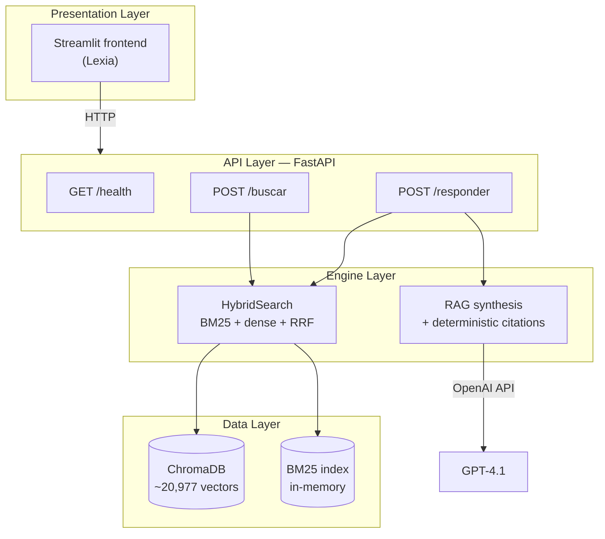

# Lexia

**A hybrid-search RAG engine over municipal legislation.**

Lexia answers natural-language legal questions about the municipal regulatory corpus of San Martín de los Andes (Argentina), returning a synthesized answer grounded in the actual normative text — with **deterministic, non-hallucinated citations** and links back to official sources.

> ⚠️ **Beta / orientation tool.** Lexia is an informational aid, not legal advice. Generated answers must always be verified against the official, in-force text.

---

## The problem

Municipal legislation is large, fragmented, and poorly indexed. The corpus behind Lexia contains **~20,977 indexed text chunks** drawn from:

- The **Municipal Organic Charter** (the local "constitution"): 218 articles + 12 transitory provisions + preamble — parsed structurally.
- The broader **municipal corpus**: ordinances, resolutions, and communications scraped from the official digest.

Finding *how a given topic is regulated* normally means manually cross-referencing a constitutional article, its implementing ordinance, and the resolutions that apply it in practice. Lexia automates that cross-referencing and presents the normative hierarchy in one answer.

---

## Architecture

Lexia is built in three decoupled layers. The business logic (search + RAG) is fully independent of any interface, so the UI can be swapped without touching the engine.



The HTTP boundary between UI and engine is deliberate: a future mobile or web client would consume the same API.

---

## Key technical decisions

### Hybrid retrieval (BM25 + dense + RRF)
Pure semantic (dense) search misses exact legal references — article numbers, ordinance codes, named institutions. Pure lexical (BM25) misses paraphrased concepts. Lexia runs both and fuses the rankings with **Reciprocal Rank Fusion (RRF)**, getting lexical precision *and* semantic recall. The decision is backed by a direct comparison harness (`test_hibrida_vs_pura.py`).

### Deterministic citations (built by Python, not the LLM)
LLMs hallucinate references. In a legal tool that is unacceptable. Lexia separates concerns:
- The **LLM** synthesizes prose and references sources *by number* (`[1]`, `[2]`, …).
- **Python** builds the actual citation strings and source links from chunk metadata, deterministically — it never invents article or ordinance numbers.

This guarantees every citation maps to a real document in the corpus.

### Two-phase search (conditional Organic Charter)
For queries that touch foundational rights, a second retrieval phase conditionally pulls in the relevant Organic Charter provisions, so answers surface the full normative chain (constitutional norm → implementing ordinance → applying resolutions).

### Derogation awareness
A dedicated subsystem (`derogation_detector.py`, `build_derogation_index.py`) flags norms that have been repealed, so the UI can mark a source as **DEROGADA** rather than presenting stale law as current.

### Structural parsing of the Organic Charter
Rather than treating the Charter as flat text, a custom parser (`co_parser.py`) extracts its real structure (articles, incisos, transitory provisions, preamble), which makes citations precise down to the article level.

---

## Stack

| Layer | Technology |
|-------|-----------|
| Engine | Python 3.12 |
| Vector store | ChromaDB |
| Lexical search | rank-bm25 (BM25Okapi) |
| Embeddings | OpenAI `text-embedding-3-small` (1536-dim) |
| Synthesis | OpenAI `gpt-4.1` |
| API | FastAPI + Uvicorn (Pydantic-typed) |
| Frontend | Streamlit |

---

## Project structure

```
digesto-search/
├── src/
│   ├── api.py                    # FastAPI layer: /health, /buscar, /responder
│   ├── search.py                 # HybridSearch: BM25 + dense + RRF fusion
│   ├── llm_answer.py             # RAG synthesis + deterministic citations
│   ├── embedder.py               # OpenAI embeddings client (batched)
│   ├── indexer.py                # ChromaDB persistence wrapper
│   ├── chunker.py                # Architecturally-aware chunking
│   ├── co_parser.py              # Structural parser for the Organic Charter
│   ├── parser.py                 # General corpus parser
│   ├── annex_extractor.py        # Annex extraction
│   ├── article_filter.py         # Article-level filtering
│   ├── derogation_detector.py    # Detects repealed norms
│   └── derogation_from_filename.py
├── scripts/
│   ├── build_index_co.py         # Build index: Organic Charter
│   ├── build_index_corpus.py     # Build index: full municipal corpus
│   ├── build_derogation_index.py # Build derogation index
│   ├── scraper_nueva_web.py      # Scraper (Laravel JSON endpoint + CSRF)
│   ├── audit_corpus.py           # Corpus auditing
│   └── test_*.py                 # Validation: CO, corpus, adversarial, hybrid-vs-pure
├── app.py                        # Streamlit frontend (Lexia)
├── .streamlit/config.toml        # UI theme
├── requirements.txt
└── .env.example                  # Config template (no secrets)
```

---

## Setup

```bash
# 1. Clone and create a virtual environment
python -m venv venv
source venv/bin/activate          # Windows: .\venv\Scripts\Activate.ps1

# 2. Install dependencies
pip install -r requirements.txt

# 3. Configure environment
cp .env.example .env              # then fill in OPENAI_API_KEY and paths
```

> **Note:** the ChromaDB vector store (~320 MB) is not included in the repo. It is built from the source corpus with the `scripts/build_index_*.py` scripts.

---

## Running

Lexia runs as two processes: the API and the UI.

```bash
# Terminal 1 — API (from the src/ directory)
cd src
uvicorn api:app --port 8000

# Terminal 2 — UI (from the project root)
streamlit run app.py
```

The API self-documents at `http://localhost:8000/docs` (interactive Swagger UI).
The frontend opens at `http://localhost:8501`.

---

## Validation

The `scripts/test_*.py` suite covers correctness from several angles: domain query sets for the Organic Charter and the broader corpus, an **adversarial** query set for hard/edge cases, and a head-to-head harness comparing hybrid retrieval against pure dense search.

---

## Status & roadmap

Lexia is in **beta**. Current focus areas:

- [ ] Per-user authentication and sessions
- [ ] Per-user query history
- [ ] Deployment to a hosted environment
- [ ] Inferred legal-relationship graph between norms

---

*Built as an applied RAG / information-retrieval project over real-world legal data.*
